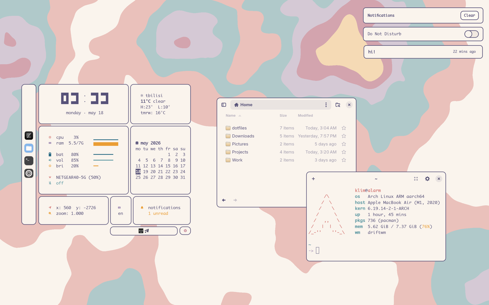

# driftwm-dotfiles

[driftwm](https://github.com/malbiruk/driftwm) rice (Rose Pine Dawn).



## What's included

```
.config/
  driftwm/      WM config, scripts, widgets (Python+uv), wallpaper shader
  waybar/       Taskbar (left) and tray (bottom) bars
  alacritty/    Terminal with rose-pine-dawn colors
  fuzzel/       Launcher
  swaync/       Notification daemon styling
  swayosd/      OSD styling (volume/brightness)
  fastfetch/    Fastfetch
  gtk-3.0/      GTK theme + icon theme + cursor settings
  gtk-4.0/      Same, plus libadwaita color overrides (rose-pine-dawn)
.local/share/icons/elementary-pastel/   Custom icon theme (elementary + Mignon-pastel apps)
```

## Dependencies

```
paru -S driftwm waybar fuzzel swaync swayosd alacritty fastfetch \
        rose-pine-gtk-theme elementary-icon-theme uv
```

Fonts:

- **Adwaita Sans** — GTK UI (set in `gtk-3.0/settings.ini`, `gtk-4.0/settings.ini`)
- **Monaco Nerd Font** — alacritty and fuzzel

Widgets use [uv](https://docs.astral.sh/uv/) — `cd ~/.config/driftwm/scripts/widgets && uv sync`.

## Notes

- **GTK theme**: `rose-pine-dawn-gtk` from AUR. `gtk-4.0/gtk.css` overrides libadwaita color vars so GTK4 apps match the palette without re-theming.
- **Icon theme**: `elementary-pastel` combines [elementary-icon-theme](https://github.com/elementary/icons) with the colorful app icons from [Mignon-pastel](https://www.gnome-look.org/p/1426967).
- **Widgets**: live in `driftwm/scripts/widgets/`, launched by `widgets/launch.sh` from `config.toml`'s autostart.

## License

MIT. See [LICENSE](LICENSE).
